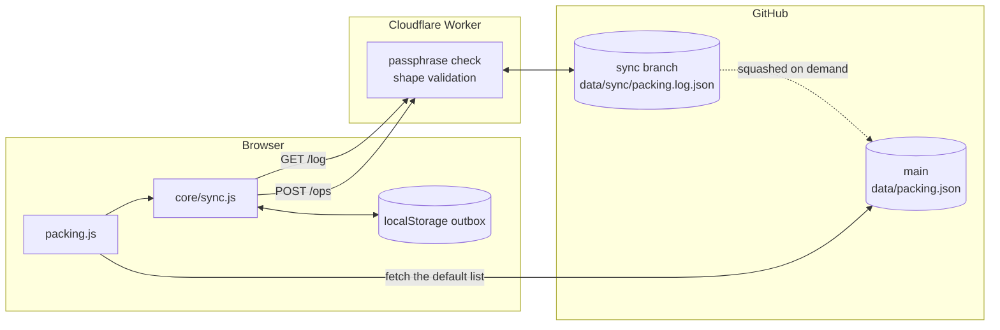

# Sharing changes without a server

How an edit made on a phone becomes something the whole group sees, on a site
that is nothing but static files.

## The problem this solves

Until now, changing anything meant opening the unsaved-changes badge, copying a
whole JSON file, and committing it over the matching file in the repository. That
works, but only one person will realistically ever do it, and two people editing
the same file means one of them loses their work.

## How it works

Nothing writes to `data/` from a browser. Instead an edit becomes a small
**operation** — "upsert this item", "remove that one" — appended to a shared log.
Everybody's page shows `committed file + log`, so the committed JSON stays the
curated starting point and the log carries what has changed since.

Operations rather than whole files, because operations compose. Two people adding
different items produce two operations that both survive; two people saving the
same file produce one winner and one silent loss.



Three deliberate choices worth knowing about:

- **A Worker holds the token, not the browser.** A GitHub token with write access
  to the repository, sitting in localStorage on six phones and shared over a
  group chat, is a credential nobody will ever rotate. The Worker keeps it as an
  encrypted secret; the group shares a passphrase instead, which is useless
  anywhere except this endpoint and can be changed in one place.
- **The log lives on an unpublished branch.** Every push to the published branch
  triggers a Pages rebuild, and Pages starts throttling around ten an hour. A
  chatty save path would hit that cliff. Writes go to a `sync` branch that Pages
  ignores, and reads come back through the Worker, so a save is visible to
  everyone in about a second instead of waiting for a deploy.
- **The Worker knows no schemas.** It authenticates, checks each operation is
  shaped correctly and aimed at a collection on its allow-list, and appends. It
  should not need editing as this pattern spreads to the other pages — only
  `COLLECTIONS` in both `tools/sync-worker/worker.js` and
  `assets/js/core/sync.js` grows, and a test asserts the two agree.

Everything degrades rather than breaking. With no endpoint configured, no
passphrase entered, or no signal, operations queue in localStorage and still show
up locally; they publish when a connection returns. If Cloudflare disappears
entirely, the page falls back to the last log it cached plus the committed file.

## Setting it up

Roughly fifteen minutes, all on free tiers, done once.

### 1. Create the branch the log lives on

An orphan branch, so it carries no site files and Pages has no reason to build
it:

```bash
git switch --orphan sync
git commit --allow-empty -m "Branch for shared edit logs. Not published."
git push -u origin sync
git switch main
```

### 2. Create a GitHub token

At **Settings → Developer settings → Personal access tokens → Fine-grained
tokens → Generate new token**:

- Repository access: **Only select repositories** → `TMB`
- Permissions → Repository permissions → **Contents: Read and write**
- Everything else: leave at No access
- Expiration: the longest allowed. Note the date — it will need replacing, and
  the symptom is saves failing with a 401.

Copy the token. GitHub shows it once.

### 3. Create the Worker

At [dash.cloudflare.com](https://dash.cloudflare.com) → **Workers & Pages** →
**Create** → **Start with Hello World** → **Deploy**. Then **Edit code**, delete
what is there, and paste the whole of `tools/sync-worker/worker.js`. Deploy.

No npm, no wrangler, no build step — consistent with the rest of this project.

### 4. Give the Worker its secrets

**Settings → Variables and Secrets**:

| Name | Type | Value |
|---|---|---|
| `GITHUB_TOKEN` | Secret | the token from step 2 |
| `SYNC_PASSPHRASE` | Secret | anything memorable; this is what the group types |
| `GITHUB_REPO` | Text | `whitchermr/TMB` |
| `ALLOWED_ORIGIN` | Text | `https://whitchermr.github.io` |
| `SYNC_BRANCH` | Text | `sync` (optional; this is the default) |

`ALLOWED_ORIGIN` is a comma-separated list. Add `http://localhost:8000` while
testing locally, and take it out afterwards.

Deploy again so the secrets take effect.

### 5. Point the site at it

Copy the Worker's URL — something like
`https://tmb-sync.your-name.workers.dev` — into `data/settings.json`:

```json
"sync": {
  "endpoint": "https://tmb-sync.your-name.workers.dev"
}
```

Commit and push. An empty endpoint means sharing is off, which is how the site
ships.

### 6. Each person joins once

Open the Packing page, press **Enter passphrase**, type the passphrase from step
4. It is stored as a device preference, so it is entered once per phone and never
appears in the repository.

## Checking it works

```bash
# Should be 401 — no passphrase.
curl -i https://tmb-sync.your-name.workers.dev/log?file=packing

# Should be {"log":[]} on a fresh setup.
curl -H "Authorization: Bearer YOUR_PASSPHRASE" \
  "https://tmb-sync.your-name.workers.dev/log?file=packing"
```

Then, in the site: add an item on one device and reload on another. A commit
should appear on the `sync` branch within a second or two.

## Keeping the log small

The log grows by one entry per edit. A few hundred is nothing, but it is not
meant to accumulate forever, so `tools/squash_sync.py` folds it into
`data/packing.json` and empties it:

```bash
./tools/squash_sync.py --file packing          # show what it would do
./tools/squash_sync.py --file packing --write  # apply it
```

It applies the log using the same reducer the browser uses rather than a second
implementation of the same rules, so a squash cannot disagree with what everyone
was looking at. Run it when the mood takes you, or when the Worker starts
refusing writes because the log hit its cap.

## When something goes wrong

| Symptom | Cause |
|---|---|
| "the group passphrase was not accepted" | `SYNC_PASSPHRASE` differs from what was typed, or the token expired — both surface as a 401 |
| Saves queue and never publish | `ALLOWED_ORIGIN` does not match the site's origin exactly, scheme included |
| "the sync service returned HTTP 502" | The GitHub token lacks Contents write, or the `sync` branch does not exist |
| "the log is full" | Run the squash script |
| Edits visible to you but nobody else | Endpoint empty in `settings.json`, so the site never left the device |

Rotating the passphrase is a one-line change to `SYNC_PASSPHRASE` plus a redeploy;
everyone re-enters it next time they save. Revoking access entirely is deleting
the GitHub token.
